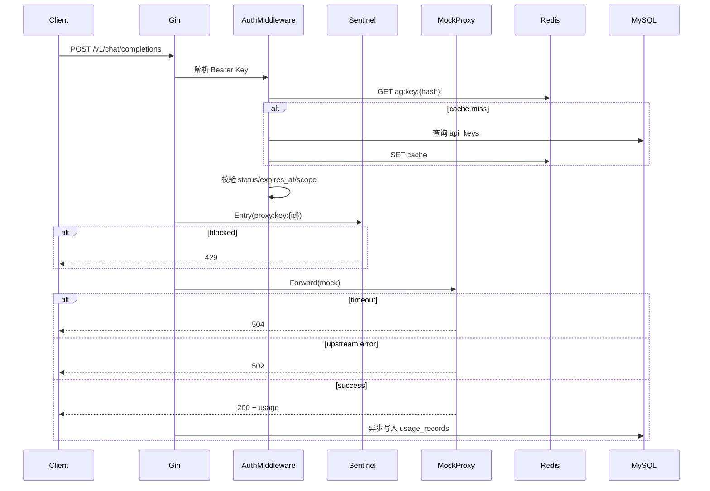

# AI Gateway MVP — 技术设计文档

> 基于 [需求文档.MD](./需求文档.MD) 拆解，技术栈：Go + Gin + GORM + MySQL + Redis + zap + sentinel-golang  
> 目标：4 小时内可交付的 MVP，支持 `docker compose up` 一键启动

---

## 1. 目标与范围

### 1.1 核心目标

构建一个 **AI Gateway MVP**，实现：

| 能力 | 说明 |
|------|------|
| 租户与 Key 管理 | 创建 tenant、多 Key；scope、启用/禁用、过期 |
| AI 代理 | OpenAI 兼容接口，下游可 mock |
| 用量追踪 | 按 tenant + Key 记录 model、token、时间戳，支持查询 |
| OpenAPI | 完整 OpenAPI 3.x，与实现一致 |
| README / Compose | 架构说明、运行步骤、curl 示例、设计决策、已知限制，`docker compose up` 一键启动 |

**4 小时交付优先级：**

- P0 必交付：Go 后端、MySQL/Redis、管理 API、OpenAI 兼容代理、用量查询、OpenAPI、README、docker compose。
- P1 选做：简易 Dashboard。若时间不足，Dashboard 不阻塞面试硬性要求。

### 1.2 不在 MVP 范围（已知限制）

- 真实上游 LLM 对接（用 mock 代替）
- 多副本分布式限流一致性（单机 sentinel 足够）
- 管理后台用户体系 / RBAC 登录（若实现 Dashboard，MVP **免登录**，见 §17）
- 计费、发票、多区域部署

### 1.3 需求覆盖矩阵

| 面试要求 | 覆盖设计 | 状态 |
|----------|----------|------|
| 创建 tenant / 多个 Key | 管理 API `POST /api/v1/tenants`、`POST /api/v1/tenants/:id/keys`；`api_keys.tenant_id` 支持 1:N | 已覆盖 |
| Key scope / 启用禁用 / 过期 | §4.1 scope 建模；§4.2/§5.2 Key 状态、过期时间、缓存失效；§7.2 校验顺序 | 已覆盖 |
| OpenAI 风格 `/v1/chat/completions` | §6.2 请求/响应结构；§6.2.1 兼容边界 | 已覆盖 |
| 401 / 403 / 502 / 504 | §4.6 错误码映射；§7.2 校验顺序；§13 自测 | 已覆盖 |
| 用量记录 tenant + Key + model + token + timestamp | §5.2 `usage_records`；§6.3 写入策略；§6.1 查询接口 | 已覆盖 |
| 用量查询 | `GET /api/v1/usage`，支持 tenant、Key、时间范围、分页和汇总 | 已覆盖 |
| OpenAPI 3.x 且与实现一致 | §12 契约文件、schema、状态码和实现对齐流程 | 已覆盖 |
| `docker compose up` 一键启动 | §11 compose 设计；README 验收项见 §12.2 | 已覆盖 |
| README 含架构、运行步骤、curl、决策、限制 | §12.2 README 内容清单 | 已覆盖 |
| 提交前自测 | §13 自测清单覆盖创建、代理、拒绝、用量、OpenAPI、错误路径 | 已覆盖 |

---

## 2. 技术栈

| 层级 | 选型 | 用途 |
|------|------|------|
| 语言 | Go 1.22+ | 主服务 |
| Web 框架 | [Gin](https://github.com/gin-gonic/gin) | HTTP 路由、中间件 |
| ORM | [GORM](https://gorm.io) | MySQL 持久化 |
| 数据库 | MySQL 8.x | 租户、Key、用量 |
| 缓存 | Redis 7.x | Key 元数据缓存、限流辅助 |
| 日志 | [uber-go/zap](https://github.com/uber-go/zap) | 结构化日志 |
| 限流 | [sentinel-golang](https://github.com/alibaba/sentinel-golang) | 按 Key / 租户 QPS 限流 |
| 接口风格 | REST API + OpenAI 兼容代理 | 管理面 REST，数据面兼容 OpenAI |
| 管理后台（选做） | [pure-admin-thin](https://github.com/pure-admin/pure-admin-thin) | Vue 3 + Vite + Element Plus + TypeScript |
| 文档 | OpenAPI 3.0 (YAML) | `api/openapi.yaml` |
| 部署 | Docker Compose | 一键启动 app + mysql + redis + admin |

### 2.1 本地默认连接信息

```yaml
mysql:
  host: localhost
  port: 3306
  user: root
  password: root
  database: ai_gateway

redis:
  host: localhost
  port: 6379
  db: 0
```

---

## 3. 系统架构

```
  浏览器 ──► pure-admin-thin (web/)  免登录，直达管理页
       │              │
       │    Axios + VITE_ADMIN_TOKEN（构建时注入）
       │              │
       ▼              ▼
                    ┌─────────────────────────────────────────┐
                    │              AI Gateway (Gin)            │
  管理端 curl ─────►│  /api/v1/*          Admin Middleware   │
                    │       │                                  │
                    │       ▼                                  │
                    │  TenantService / KeyService / UsageSvc   │
                    │       │                                  │
  调用方 OpenAI ──►│  /v1/chat/completions                    │
  SDK / curl       │       │                                  │
                    │       ▼                                  │
                    │  Auth → Sentinel → Proxy → UsageWriter  │
                    └───────┬──────────────┬──────────────────┘
                            │              │
                       MySQL (GORM)    Redis (cache)
                            │
                       Mock Upstream (内置 HTTP 或本地 handler)
```

### 3.1 分层职责

| 层 | 包路径 | 职责 |
|----|--------|------|
| `cmd/server` | 入口 | 加载配置、初始化依赖、启动 HTTP |
| `internal/config` | 配置 | 环境变量 / YAML |
| `internal/handler` | HTTP 层 | 参数校验、响应封装 |
| `internal/middleware` | 中间件 | 鉴权、日志、限流、RequestID |
| `internal/service` | 业务层 | 租户/Key/用量/代理编排 |
| `internal/repository` | 数据访问 | GORM CRUD |
| `internal/proxy` | 代理 | 转发/ mock、超时、错误映射 |
| `internal/model` | 实体 | GORM model + DTO |
| `pkg/response` | 公共 | 统一错误码、JSON  envelope |
| `api/openapi.yaml` | 契约 | OpenAPI 3.x |

---

## 4. 设计决策与 Trade-off

### 4.1 Scope 建模（需求要求自行说明）

**方案：字符串资源列表（RBAC 风格，可扩展）**

```json
{
  "scopes": ["chat:completions", "models:read"]
}
```

| Scope 常量 | 含义 | 所需接口 |
|------------|------|----------|
| `chat:completions` | 聊天补全 | `POST /v1/chat/completions` |
| `models:read` | 模型列表 | `GET /v1/models` |

**规则：**

- Key 的 `scopes` 为 JSON 数组，存 MySQL `JSON` 列
- 请求路径映射到所需 scope；Key 不包含则 **403**
- `scopes` 为空数组 `[]`：MVP 视为 **无权限**（安全默认）
- 创建 Key 时未传 scopes：默认 `["chat:completions"]`

**Trade-off：** 比 bitmask 可读性好，比完整 RBAC 简单；后续可加 `embeddings:create` 等而不改表结构。

### 4.2 API Key 存储

- 明文 Key **仅创建时返回一次**（格式：`sk-ag-{random32}`）
- 库内存 **SHA-256 哈希** + **前缀 8 位**（便于列表展示与排查）
- 鉴权：对入参 Bearer token 做 SHA-256 后查库/缓存

**Trade-off：** 不做 bcrypt（高 QPS 代理场景哈希成本低更重要）；MVP 可接受。

### 4.2.1 Key 生命周期与缓存一致性

| 操作 | 行为 | 缓存处理 |
|------|------|----------|
| 创建 Key | 生成明文 secret，仅响应一次；落库 hash/prefix/scopes/expires_at/status | 不预热，首次鉴权回源 |
| 启用 / 禁用 | 更新 `status`；禁用后代理请求返回 403 `key_disabled` | `DEL ag:key:{hash}` |
| 更新 scope | 覆盖 scopes JSON；下一次请求按新 scope 校验 | `DEL ag:key:{hash}` |
| 更新过期时间 | 支持设置具体时间或 `null` 永不过期 | `DEL ag:key:{hash}` |
| 删除 Key | **软删除**，保留历史用量可追溯；列表默认不返回 deleted | `DEL ag:key:{hash}` |

**设计约束：**

- 一个 tenant 可创建多个 Key；同租户下 Key `name` 可重复，避免为了备注名引入额外失败路径。
- `usage_records.api_key_id` 永远指向创建时的 Key ID，因此 Key 删除必须软删除，不能物理删除历史引用。
- Key 禁用、过期、scope 不足都属于已识别 Key 的拒绝路径，统一返回 403；无 Bearer 或 hash 不存在返回 401。

### 4.3 管理 API 鉴权

- 环境变量 `ADMIN_TOKEN`（默认 compose 内写死 `admin-dev-token`）
- Header：`Authorization: Bearer <ADMIN_TOKEN>`
- 代理面与管理面路由分离，降低误暴露风险
- **管理后台免登录**：前端不展示登录页、不做用户会话；Axios 拦截器自动附带 `ADMIN_TOKEN`（见 §17）
- curl / 外部调用方仍须手动传 `Authorization` Header

### 4.4 限流策略（sentinel-golang）

| 资源名 | 维度 | 默认阈值 | 超限响应 |
|--------|------|----------|----------|
| `proxy:global` | 全站 | 100 QPS | 429 |
| `proxy:key:{key_id}` | 单 Key | 20 QPS | 429 |
| `proxy:tenant:{tenant_id}` | 单租户 | 50 QPS | 429 |

- 规则在启动时加载，可通过配置文件调整
- Redis 可选做计数展示；**限流决策以 sentinel 内存为准**（MVP 单机）

### 4.5 下游 Mock

- 不发起真实外网请求，使用 `internal/proxy/mock.go` 本地生成 OpenAI 格式响应
- 根据 `model` 返回固定 content，`usage` 按请求 `messages` 粗算 token（字符数/4 估算即可）
- 支持配置 `MOCK_LATENCY_MS` 模拟延迟；支持 `MOCK_FAIL=true` 测 502

### 4.6 错误码映射（需求明确要求）

| 场景 | HTTP | 说明 |
|------|------|------|
| 请求体非法 / 不支持 stream | **400** | `invalid_request` / `stream_not_supported` |
| 无 Authorization / Key 不存在 | **401** | `invalid_api_key` |
| Key 禁用 / 过期 / scope 不足 | **403** | `key_disabled` / `key_expired` / `insufficient_scope` |
| Mock/上游返回 5xx 或解析失败 | **502** | `bad_gateway` |
| 上游超时（代理 timeout 默认 30s） | **504** | `gateway_timeout` |
| Sentinel 限流 | **429** | `rate_limit_exceeded` |

OpenAI 兼容错误体：

```json
{
  "error": {
    "message": "Your API key is invalid",
    "type": "invalid_request_error",
    "code": "invalid_api_key"
  }
}
```

---

## 5. 数据模型（MySQL + GORM）

### 5.1 ER 关系

```
tenants 1 ── N api_keys 1 ── N usage_records
```

### 5.2 表结构

#### `tenants`

| 字段 | 类型 | 说明 |
|------|------|------|
| id | BIGINT PK AI | |
| name | VARCHAR(128) UNIQUE | 租户名 |
| status | TINYINT | 1=active, 0=inactive |
| created_at | DATETIME(3) | |
| updated_at | DATETIME(3) | |

#### `api_keys`

| 字段 | 类型 | 说明 |
|------|------|------|
| id | BIGINT PK AI | |
| tenant_id | BIGINT INDEX FK | |
| name | VARCHAR(128) | Key 备注名 |
| key_prefix | VARCHAR(16) | 展示用前缀 |
| key_hash | CHAR(64) UNIQUE | SHA-256 hex |
| scopes | JSON | 见 4.1 |
| status | TINYINT | 1=enabled, 0=disabled, 2=deleted |
| expires_at | DATETIME(3) NULL | NULL=永不过期 |
| deleted_at | DATETIME(3) NULL INDEX | 软删除，保留 usage 追溯 |
| created_at | DATETIME(3) | |
| updated_at | DATETIME(3) | |

#### `usage_records`

| 字段 | 类型 | 说明 |
|------|------|------|
| id | BIGINT PK AI | |
| tenant_id | BIGINT INDEX | |
| api_key_id | BIGINT INDEX | |
| model | VARCHAR(64) | |
| prompt_tokens | INT | |
| completion_tokens | INT | |
| total_tokens | INT | |
| latency_ms | INT | 代理耗时 |
| status | VARCHAR(16) | success / error |
| requested_at | DATETIME(3) INDEX | |

### 5.3 GORM 自动迁移

启动时 `AutoMigrate(&Tenant{}, &APIKey{}, &UsageRecord{})`，compose 首次启动即可建表。

### 5.4 Redis 缓存

| Key 模式 | TTL | Value |
|----------|-----|-------|
| `ag:key:{hash}` | 5min | JSON：tenant_id, key_id, scopes, status, expires_at |

- Key 更新/禁用时主动 `DEL`
- 缓存 miss 回源 MySQL

---

## 6. API 设计

### 6.1 管理面 REST（前缀 `/api/v1`）

统一响应（管理面）：

```json
{
  "code": 0,
  "message": "ok",
  "data": {}
}
```

| 方法 | 路径 | 说明 |
|------|------|------|
| POST | `/api/v1/tenants` | 创建租户 |
| GET | `/api/v1/tenants` | 列表（分页） |
| GET | `/api/v1/tenants/:id` | 详情 |
| PATCH | `/api/v1/tenants/:id` | 更新状态/名称 |
| POST | `/api/v1/tenants/:id/keys` | 创建 Key（返回明文一次） |
| GET | `/api/v1/tenants/:id/keys` | Key 列表（无明文） |
| GET | `/api/v1/tenants/:id/keys/:key_id` | Key 详情 |
| PATCH | `/api/v1/tenants/:id/keys/:key_id` | 更新 scopes/status/expires_at |
| DELETE | `/api/v1/tenants/:id/keys/:key_id` | 软删 Key，保留历史 usage |
| GET | `/api/v1/usage` | 用量查询 |
| GET | `/health` | 健康检查 |
| GET | `/openapi.yaml` | 暴露 OpenAPI 文件 |

#### 创建租户

```http
POST /api/v1/tenants
Authorization: Bearer admin-dev-token
Content-Type: application/json

{"name": "acme-corp"}
```

#### 创建 Key

```http
POST /api/v1/tenants/1/keys
Authorization: Bearer admin-dev-token

{
  "name": "prod-key",
  "scopes": ["chat:completions"],
  "expires_at": "2026-12-31T23:59:59Z"
}
```

响应 `data.secret_key` 仅此次返回。

#### 用量查询

```http
GET /api/v1/usage?tenant_id=1&api_key_id=2&from=2026-07-01T00:00:00Z&to=2026-07-06T23:59:59Z&page=1&page_size=20
Authorization: Bearer admin-dev-token
```

响应含 `items[]` 与 `summary`（total_tokens 聚合）。

### 6.2 数据面 OpenAI 兼容（前缀 `/v1`）

| 方法 | 路径 | Scope |
|------|------|-------|
| POST | `/v1/chat/completions` | `chat:completions` |
| GET | `/v1/models` | `models:read` |

鉴权：`Authorization: Bearer sk-ag-xxx`

### 6.2.1 OpenAI 兼容边界

MVP 目标是让调用方可以用 OpenAI 风格请求体走通代理，不追求完整 OpenAI API 全量能力。

| 字段 / 能力 | MVP 行为 |
|-------------|----------|
| `model` | 必填，字符串；mock 至少在 `/v1/models` 暴露 `gpt-4o-mini`，chat 接口接受任意非空 model 并在响应中原样返回 |
| `messages` | 必填，非空数组；支持 `system` / `user` / `assistant` role，`content` 按字符串处理 |
| `temperature` / `top_p` / `max_tokens` | 可选接收，mock 不实际采样，仅原样校验基础类型 |
| `stream` | 可选；MVP 不支持 SSE，若为 `true` 返回 400 `stream_not_supported`，避免调用方误以为是流式响应 |
| 响应格式 | 返回 OpenAI chat completion JSON：`id/object/created/model/choices/usage` |
| 错误格式 | 返回 OpenAI 风格 `{ "error": { "message", "type", "code" } }` |

**实现约束：** `api/openapi.yaml` 必须明确 `stream=true` 的 400 行为；README curl 示例使用非流式请求。

#### Chat Completions 请求/响应

请求体兼容 OpenAI（`model`, `messages`, `stream` 等）：

```http
POST /v1/chat/completions
Authorization: Bearer sk-ag-xxxxxxxx
Content-Type: application/json

{
  "model": "gpt-4o-mini",
  "messages": [{"role": "user", "content": "Hello"}]
}
```

MVP：**不支持 `stream=true`**；请求中传 `stream: true` 时返回 400 `stream_not_supported`，避免客户端误判为 SSE 流式响应。

成功响应（mock）：

```json
{
  "id": "chatcmpl-mock-xxx",
  "object": "chat.completion",
  "created": 1710000000,
  "model": "gpt-4o-mini",
  "choices": [{
    "index": 0,
    "message": {"role": "assistant", "content": "This is a mock response from AI Gateway."},
    "finish_reason": "stop"
  }],
  "usage": {
    "prompt_tokens": 10,
    "completion_tokens": 12,
    "total_tokens": 22
  }
}
```

代理成功后 **异步写入** `usage_records`（不阻塞响应；失败只打日志）。

### 6.3 用量写入策略

`usage_records` 用于用量与排障，不承担安全审计。写入规则如下：

| 场景 | 是否写 usage | 记录内容 |
|------|--------------|----------|
| 代理成功 | 是 | tenant_id、api_key_id、model、prompt/completion/total tokens、latency_ms、status=`success`、requested_at |
| 已识别 Key，但 mock/上游 502 | 是 | tenant_id、api_key_id、model、tokens 若不可得则为 0、latency_ms、status=`error` |
| 已识别 Key，但代理超时 504 | 是 | tenant_id、api_key_id、model、tokens=0、latency_ms、status=`error` |
| 无 Bearer / Key 不存在 401 | 否 | 无有效 tenant/key 归属，避免污染用量 |
| Key 禁用 / 过期 / scope 不足 403 | 否 | 属于鉴权拒绝，不计入模型用量 |

查询接口 `GET /api/v1/usage` 默认按 `requested_at DESC` 返回明细，并在 `summary` 中聚合 `prompt_tokens`、`completion_tokens`、`total_tokens`、`success_count`、`error_count`。

---

## 7. 核心流程

### 7.1 代理请求时序



### 7.2 Key 校验顺序

1. Bearer 是否存在 → 401
2. 哈希查 Key → 401
3. `status == disabled` → 403
4. `expires_at < now` → 403
5. tenant `status == inactive` → 403
6. scope 检查 → 403
7. sentinel 限流 → 429

---

## 8. 项目目录结构

```
ai_gateway/
├── web/                          # 选做：pure-admin-thin 管理后台（免登录）
│   ├── src/
│   │   ├── api/                  # 封装 /api/v1 请求
│   │   ├── router/modules/       # 租户、Key、用量路由
│   │   └── views/
│   │       ├── tenant/           # 租户管理
│   │       ├── apikey/           # Key 管理
│   │       └── usage/            # 用量查询
│   ├── .env.development
│   ├── .env.production
│   ├── vite.config.ts
│   └── package.json
├── api/
│   └── openapi.yaml              # OpenAPI 3.0 完整 spec
├── cmd/
│   └── server/
│       └── main.go
├── internal/
│   ├── config/
│   │   └── config.go
│   ├── handler/
│   │   ├── tenant.go
│   │   ├── apikey.go
│   │   ├── usage.go
│   │   └── proxy.go
│   ├── middleware/
│   │   ├── admin_auth.go
│   │   ├── apikey_auth.go
│   │   ├── logger.go
│   │   ├── recovery.go
│   │   └── sentinel.go
│   ├── model/
│   │   ├── tenant.go
│   │   ├── api_key.go
│   │   └── usage_record.go
│   ├── repository/
│   │   ├── tenant.go
│   │   ├── api_key.go
│   │   └── usage.go
│   ├── service/
│   │   ├── tenant.go
│   │   ├── apikey.go
│   │   ├── usage.go
│   │   └── auth.go
│   └── proxy/
│       ├── client.go
│       └── mock.go
├── pkg/
│   ├── crypto/hash.go            # SHA-256
│   ├── response/response.go
│   └── scope/scope.go            # scope 常量与校验
├── configs/
│   └── config.yaml
├── docker-compose.yml
├── Dockerfile                    # Go 后端镜像
├── Dockerfile.web                # 选做：管理后台 nginx 静态镜像
├── go.mod
├── go.sum
├── Makefile
└── README.md
```

---

## 9. 中间件与依赖初始化

### 9.1 启动顺序

1. 加载 `config`（viper 或 env）
2. 初始化 `zap` Logger（生产 JSON / 开发 Console）
3. 连接 MySQL → GORM `AutoMigrate`
4. 连接 Redis
5. 初始化 sentinel 规则（`middleware.InitSentinel`）
6. 注册 Gin 路由
7. 监听 `:8080`

### 9.2 Gin 路由注册

```go
// 公共
r.GET("/health", healthHandler)
r.GET("/openapi.yaml", serveOpenAPI)

// 管理面
admin := r.Group("/api/v1", middleware.AdminAuth())
{
    admin.POST("/tenants", ...)
    admin.GET("/tenants", ...)
    // ...
    admin.GET("/usage", ...)
}

// OpenAI 兼容
v1 := r.Group("/v1", middleware.RequestLogger(), middleware.Recovery())
{
    v1.POST("/chat/completions",
        middleware.APIKeyAuth(scope.ChatCompletions),
        middleware.SentinelKeyRateLimit(),
        proxyHandler.ChatCompletions)
    v1.GET("/models",
        middleware.APIKeyAuth(scope.ModelsRead),
        proxyHandler.ListModels)
}
```

### 9.3 日志字段（zap）

每条请求至少包含：`request_id`, `method`, `path`, `status`, `latency_ms`, `tenant_id`, `api_key_id`（代理面）。

---

## 10. 配置项

| 环境变量 | 默认值 | 说明 |
|----------|--------|------|
| `APP_PORT` | `8080` | HTTP 端口 |
| `ADMIN_TOKEN` | `admin-dev-token` | 管理 API Token |
| `MYSQL_DSN` | `root:root@tcp(mysql:3306)/ai_gateway?...` | GORM DSN |
| `REDIS_ADDR` | `redis:6379` | Redis 地址 |
| `PROXY_TIMEOUT_SEC` | `30` | 代理超时 → 504 |
| `MOCK_LATENCY_MS` | `0` | Mock 延迟 |
| `MOCK_FAIL` | `false` | 强制 502 |
| `KEY_CACHE_TTL_SEC` | `300` | Redis Key 缓存 TTL |
| `RATE_LIMIT_KEY_QPS` | `20` | 单 Key 限流 |
| `RATE_LIMIT_TENANT_QPS` | `50` | 单租户限流 |
| `GIN_MODE` | `release` | Gin 模式 |
| `VITE_API_BASE_URL` | `http://localhost:8080` | 管理后台 API 基址（web/.env） |
| `VITE_ADMIN_TOKEN` | `admin-dev-token` | 管理后台内置 Token（免登录注入） |

---

## 11. Docker Compose

```yaml
services:
  mysql:
    image: mysql:8.0
    environment:
      MYSQL_ROOT_PASSWORD: root
      MYSQL_DATABASE: ai_gateway
    ports: ["3306:3306"]
    volumes: [mysql_data:/var/lib/mysql]
    healthcheck:
      test: ["CMD", "mysqladmin", "ping", "-h", "localhost", "-uroot", "-proot"]

  redis:
    image: redis:7-alpine
    ports: ["6379:6379"]
    healthcheck:
      test: ["CMD", "redis-cli", "ping"]

  app:
    build: .
    ports: ["8080:8080"]
    environment:
      MYSQL_DSN: "root:root@tcp(mysql:3306)/ai_gateway?charset=utf8mb4&parseTime=True&loc=Local"
      REDIS_ADDR: "redis:6379"
      ADMIN_TOKEN: "admin-dev-token"
    depends_on:
      mysql: { condition: service_healthy }
      redis: { condition: service_healthy }

  admin:
    profiles: ["dashboard"]
    build:
      context: ./web
      dockerfile: ../Dockerfile.web
      args:
        VITE_API_BASE_URL: "http://localhost:8080"
        VITE_ADMIN_TOKEN: "admin-dev-token"
    ports: ["8848:80"]
    depends_on:
      - app

volumes:
  mysql_data:
```

默认 `docker compose up --build` 启动 P0 必交付服务：`mysql`、`redis`、`app`。
若已实现选做 Dashboard，再执行：

```bash
docker compose --profile dashboard up --build
```

访问管理后台：http://localhost:8848（打开即用，无需登录）

---

## 12. OpenAPI 文档要求

- 文件：`api/openapi.yaml`
- 版本：OpenAPI 3.0.3
- 需覆盖：**全部管理面接口** + **代理面主要接口** + **统一错误 schema**
- 通过 `GET /openapi.yaml` 静态暴露，README 中说明可用 Swagger Editor 打开
- 实现后 **逐接口对齐**：路径、方法、请求体、响应码与 spec 一致

### 12.1 OpenAPI 完整性清单

`api/openapi.yaml` 至少包含以下内容，避免“有文件但不完整”：

| 类别 | 必须覆盖 |
|------|----------|
| `info` | title、version、description |
| `servers` | `http://localhost:8080` |
| `securitySchemes` | `AdminBearerAuth`、`GatewayAPIKeyAuth` |
| 管理面 paths | tenants CRUD、tenant keys CRUD、usage query、health、openapi.yaml |
| 数据面 paths | `POST /v1/chat/completions`、`GET /v1/models` |
| 请求 schemas | `CreateTenantRequest`、`UpdateTenantRequest`、`CreateAPIKeyRequest`、`UpdateAPIKeyRequest`、`ChatCompletionRequest`、`UsageQuery` |
| 响应 schemas | `Tenant`、`APIKey`（无明文）、`CreatedAPIKey`（含一次性 `secret_key`）、`UsageRecord`、`UsageSummary`、`ChatCompletionResponse`、`ModelListResponse` |
| 错误 schemas | 管理面统一 envelope、OpenAI 风格 `ErrorResponse` |
| 状态码 | 200/201/400/401/403/404/409/429/502/504 |

每个接口的实现完成后按以下规则检查：

1. 路径参数名一致，例如 OpenAPI 使用 `{tenant_id}`，Gin 路由也用 `tenant_id`。
2. JSON 字段名一致，例如 `expires_at`、`api_key_id`、`prompt_tokens`。
3. 成功响应 envelope 一致：管理面 `{code,message,data}`，数据面 OpenAI 原生格式。
4. 错误响应码一致，尤其是 401/403/502/504 不混用。
5. README curl 示例能直接对照 OpenAPI 中的请求体。

### 12.2 README 必填内容

README 是面试交付物的一部分，必须包含：

| 章节 | 内容 |
|------|------|
| 项目简介 | AI Gateway MVP 能力、技术栈、端口 |
| 架构说明 | 管理面、数据面、MySQL、Redis、Mock upstream 的关系 |
| 快速启动 | `docker compose up --build`，等待 app/mysql/redis healthy |
| 配置说明 | `ADMIN_TOKEN`、`MYSQL_DSN`、`REDIS_ADDR`、`PROXY_TIMEOUT_SEC`、mock 配置 |
| curl 自测 | 创建 tenant、创建 Key、调用 `/v1/chat/completions`、查询 usage、禁用/过期/越权 Key |
| OpenAPI | `api/openapi.yaml` 路径与 `GET /openapi.yaml` |
| 设计决策 | scope、Key hash、mock、usage 写入、错误映射、限流取舍 |
| 已知限制 | mock、非流式、估算 token、单机限流、管理 Token、Dashboard 是否选做 |
| 提交说明 | GitHub 仓库链接，说明如何复现自测 |

---

## 13. 自测清单（对应需求）

| # | 检查项 | 验证方式 |
|---|--------|----------|
| 1 | `docker compose up` 可运行 | 容器 healthy，`/health` 200 |
| 2 | 创建 tenant / Key | `curl` 管理 API |
| 3 | OpenAI 风格调用 | `POST /v1/chat/completions` |
| 4 | 至少 1 个 model 走通 mock | 返回 choices + usage |
| 5 | 无效 Key → 401 | 错误 Bearer |
| 6 | 禁用 Key → 403 | PATCH `status=0` 后调用代理 |
| 7 | 过期 Key → 403 | `expires_at` 过去时间 |
| 8 | 越权 Key → 403 | 无 `chat:completions` scope |
| 9 | `stream=true` → 400 | 返回 `stream_not_supported` |
| 10 | Mock/上游失败 → 502 | `MOCK_FAIL=true` |
| 11 | Mock/上游超时 → 504 | `MOCK_LATENCY_MS > PROXY_TIMEOUT_SEC*1000` |
| 12 | 用量可查询 | `GET /api/v1/usage`，包含 success/error 聚合 |
| 13 | OpenAPI 一致 | 对照 yaml 与实现 |
| 14 | README 可复现 | 按 README curl 从零跑通 |
| 15 | 管理后台免登录可用（选做） | 打开 http://localhost:8848 直达租户/Key/用量页 |

### 13.1 示例 curl（写入 README）

```bash
# 1. 创建租户
curl -s -X POST http://localhost:8080/api/v1/tenants \
  -H "Authorization: Bearer admin-dev-token" \
  -H "Content-Type: application/json" \
  -d '{"name":"demo"}'

# 2. 创建 Key（记下 secret_key）
curl -s -X POST http://localhost:8080/api/v1/tenants/1/keys \
  -H "Authorization: Bearer admin-dev-token" \
  -H "Content-Type: application/json" \
  -d '{"name":"default","scopes":["chat:completions"]}'

# 3. 调用代理
curl -s -X POST http://localhost:8080/v1/chat/completions \
  -H "Authorization: Bearer sk-ag-XXXX" \
  -H "Content-Type: application/json" \
  -d '{"model":"gpt-4o-mini","messages":[{"role":"user","content":"hi"}]}'

# 4. 查询用量
curl -s "http://localhost:8080/api/v1/usage?tenant_id=1" \
  -H "Authorization: Bearer admin-dev-token"
```

---

## 14. 实施任务拆分（建议 4h 内顺序）

### 14.1 P0 必交付（目标 4 小时内）

| 阶段 | 任务 | 预估 |
|------|------|------|
| P0 | 项目脚手架、go.mod、config、docker-compose、health | 20min |
| P0 | GORM models + AutoMigrate + repositories | 25min |
| P0 | 租户 / Key CRUD handlers + admin auth + Key 软删除 | 35min |
| P0 | API Key 鉴权中间件 + scope 校验 + Redis 缓存失效 | 25min |
| P0 | Mock proxy + chat completions + 400/401/403/502/504 | 35min |
| P0 | 用量异步写入 + 查询 API + summary 聚合 | 20min |
| P0 | sentinel 限流 + zap 请求日志 | 10min |
| P0 | OpenAPI yaml 与实现对齐 | 20min |
| P0 | README、curl、自测修正 | 20min |

合计约 210min，预留约 30min 做 docker compose 联调与问题修正。若时间收紧，sentinel 限流可以降级为简单内存限流或暂列已知限制，但 401/403/502/504、OpenAPI、README 不降级。

### 14.2 P1 选做 Dashboard

| 阶段 | 任务 | 预估 |
|------|------|------|
| P1 | pure-admin-thin 脚手架 + 免登录改造 | 40min |
| P1 | 租户 / Key / 用量三个管理页面 | 45min |
| P1 | Dashboard compose/nginx 联调 | 20min |

Dashboard 是需求中的选做项。只有 P0 全部通过自测后再做，避免影响必交付质量。

---

## 15. 关键依赖（go.mod 参考）

```
github.com/gin-gonic/gin
gorm.io/gorm
gorm.io/driver/mysql
github.com/redis/go-redis/v9
go.uber.org/zap
github.com/alibaba/sentinel-golang
github.com/google/uuid
github.com/spf13/viper          // 可选
```

---

## 16. 已知限制（README 需写明）

1. 仅 mock 下游，不对接真实 OpenAI/其他厂商
2. 不支持 `stream=true` 流式响应
3. Token 计数为估算值，非 tiktoken 精确计算
4. 限流为进程内 sentinel，多实例不共享配额
5. API Key 明文不可找回，丢失需重新创建
6. 管理面仅单 Token，无 RBAC 多管理员
7. 若实现选做管理后台：管理后台 **免登录**，Token 编译进前端产物，**仅限内网 / Demo**，不可公网暴露

---

## 17. 管理后台：pure-admin-thin（免登录）

### 17.1 选型说明

采用 [pure-admin-thin](https://github.com/pure-admin/pure-admin-thin)（vue-pure-admin 官方精简版）作为管理后台脚手架：

| 项 | 说明 |
|----|------|
| 技术 | Vue 3 + Vite + Element Plus + TypeScript |
| 优势 | 布局、表格、表单、分页等开箱即用，适合 4h MVP 快速交付 |
| 许可 | MIT |
| 文档 | [vue-pure-admin 文档](https://pure-admin.cn/) |

初始化方式（写入 README）：

```bash
# 在项目根目录
git clone --depth 1 https://github.com/pure-admin/pure-admin-thin.git web
cd web && pnpm install
```

### 17.2 免登录方案（MVP 核心决策）

pure-admin-thin 默认带登录页与动态路由权限。MVP **去掉登录流程**，打开站点直接进入管理功能。

**原则：** 用户无感知鉴权；`ADMIN_TOKEN` 由构建环境变量注入，不写死在源码中。

#### 改造点一览

| 文件 / 模块 | 改动 |
|-------------|------|
| `src/router/index.ts` | 移除或短路 `beforeEach` 中的 `isLogin` / `getToken` 判断；未登录时 **不再跳转 `/login`** |
| `src/router/modules/` | 删除登录相关路由；静态注册 `tenant`、`apikey`、`usage` 三个业务模块 |
| `src/store/modules/user.ts` | 提供固定的 mock 用户信息（如 `roles: ["admin"]`），满足布局组件对 `username` / `avatar` 的读取 |
| `src/utils/http/index.ts` | Axios 请求拦截器：`Authorization: Bearer ${import.meta.env.VITE_ADMIN_TOKEN}` |
| `src/views/login/` | 可保留文件但不注册路由；默认首页重定向到 `/tenant/index` |
| `.env.development` | `VITE_API_BASE_URL=http://localhost:8080`、`VITE_ADMIN_TOKEN=admin-dev-token` |
| `.env.production` | 与 compose 构建参数一致 |
| `vite.config.ts` | `server.proxy`：`/api` → `VITE_API_BASE_URL`（本地 dev 跨域） |

#### 路由守卫伪代码

```typescript
// src/router/index.ts — MVP 免登录
router.beforeEach((to, _from, next) => {
  // 跳过 token 校验，直接放行
  if (to.matched.length === 0) {
    next("/tenant/index");
  } else {
    next();
  }
});
```

#### Axios 拦截器

```typescript
// src/utils/http/index.ts
config.headers.Authorization = `Bearer ${import.meta.env.VITE_ADMIN_TOKEN}`;
```

**Trade-off：** 免登录 + Token 编译进前端 = **零运维成本、适合 Demo/内网**；生产环境须恢复登录或接入 SSO，且 Token 不可打包进公网前端。

### 17.3 页面与菜单

| 菜单 | 路由 | 功能 |
|------|------|------|
| 租户管理 | `/tenant/index` | 列表、新建、启用/禁用 |
| API Key | `/apikey/index` | 按租户筛选；创建 Key（弹窗一次性展示 `secret_key`）；编辑 scope / 状态 / 过期时间 |
| 用量统计 | `/usage/index` | 按租户、Key、时间范围查询；表格 + `total_tokens` 汇总 |

侧边栏在 `src/router/modules/remaining.ts`（或新建 `gateway.ts`）中配置：

```typescript
export default {
  path: "/tenant",
  meta: { title: "租户管理", icon: "ep:user" },
  children: [
    { path: "/tenant/index", name: "Tenant", component: () => import("@/views/tenant/index.vue"), meta: { title: "租户列表" } }
  ]
} satisfies RouteConfigsTable;
```

### 17.4 API 封装（`src/api/gateway.ts`）

与后端 `/api/v1` 对齐，统一解析 `{ code, message, data }`：

```typescript
export const listTenants = (params?: PageParams) =>
  http.get("/api/v1/tenants", { params });

export const createTenant = (data: { name: string }) =>
  http.post("/api/v1/tenants", { data });

export const listKeys = (tenantId: number) =>
  http.get(`/api/v1/tenants/${tenantId}/keys`);

export const createKey = (tenantId: number, data: CreateKeyDto) =>
  http.post(`/api/v1/tenants/${tenantId}/keys`, { data });

export const listUsage = (params: UsageQuery) =>
  http.get("/api/v1/usage", { params });
```

### 17.5 本地开发

```bash
# 终端 1：后端
docker compose up mysql redis app
# 或 go run ./cmd/server

# 终端 2：管理后台
cd web && pnpm dev
# 默认 http://localhost:5173 ，免登录直达 /tenant/index
```

### 17.6 生产构建与 CORS

- 构建：`cd web && pnpm build`，产物 `web/dist`
- `Dockerfile.web`：多阶段构建 → nginx 托管静态资源
- 后端 Gin 增加 CORS（仅 admin 域名）或 nginx 反代 `/api` 到 `app:8080`，避免浏览器跨域

```go
// internal/middleware/cors.go — 允许管理后台源
r.Use(cors.New(cors.Config{
    AllowOrigins: []string{"http://localhost:8848", "http://localhost:5173"},
    AllowHeaders: []string{"Authorization", "Content-Type"},
}))
```

### 17.7 目录约定（web 内新增）

```
web/src/
├── api/
│   └── gateway.ts           # 后端 API 封装
├── views/
│   ├── tenant/
│   │   └── index.vue        # 租户 CRUD
│   ├── apikey/
│   │   └── index.vue        # Key 管理（含 secret 一次性展示）
│   └── usage/
│       └── index.vue        # 用量查询
└── router/modules/
    └── gateway.ts           # 业务路由与菜单
```

---

*文档版本：v1.2 | 补齐需求覆盖矩阵、Key 生命周期、OpenAPI/README 验收、P0/P1 交付边界*
